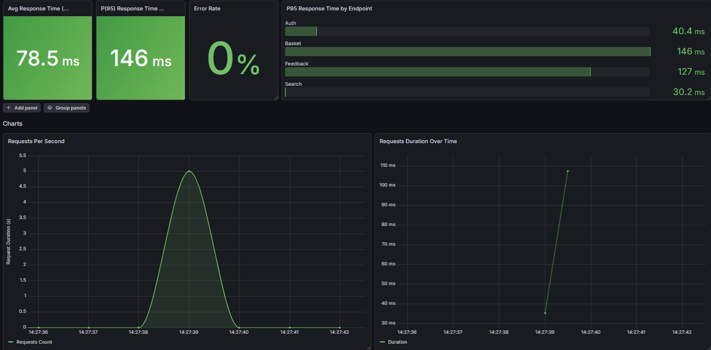
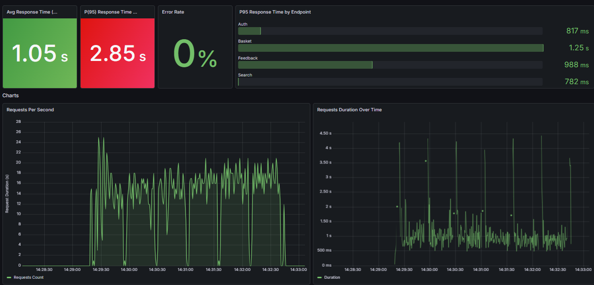
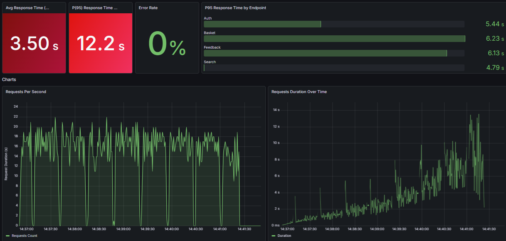
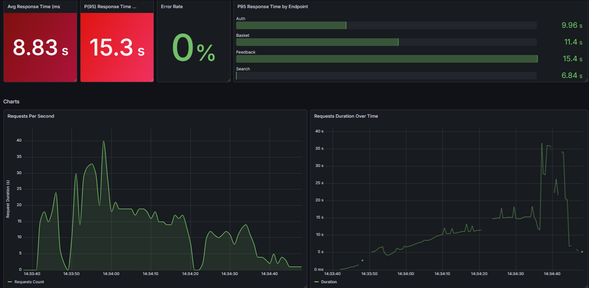
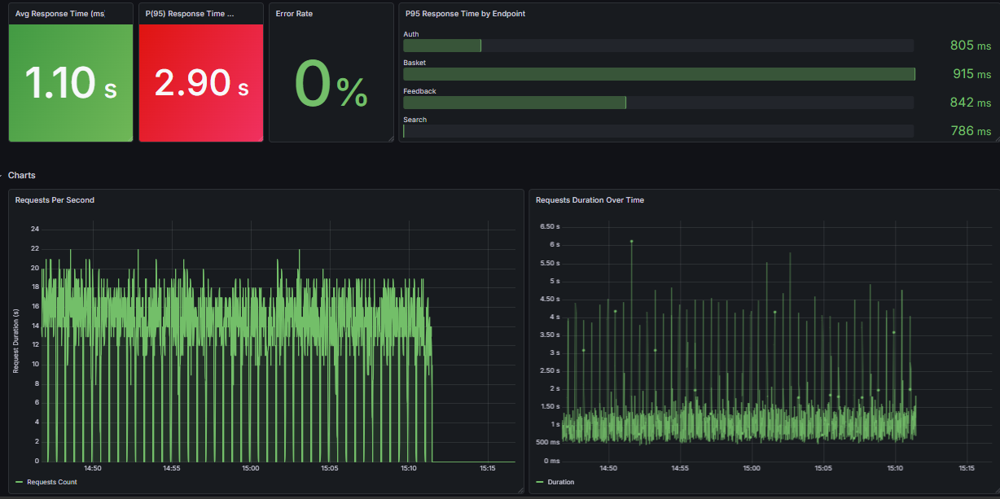
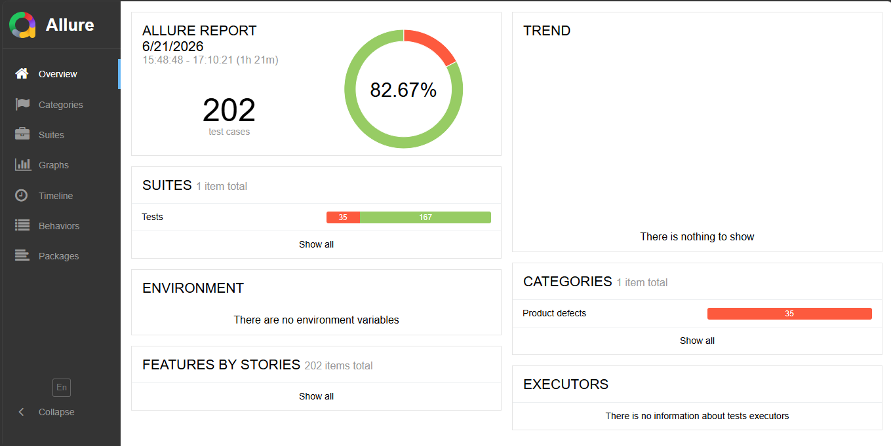
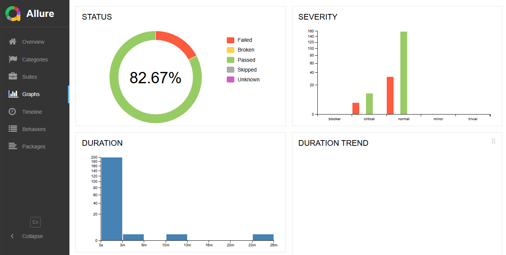
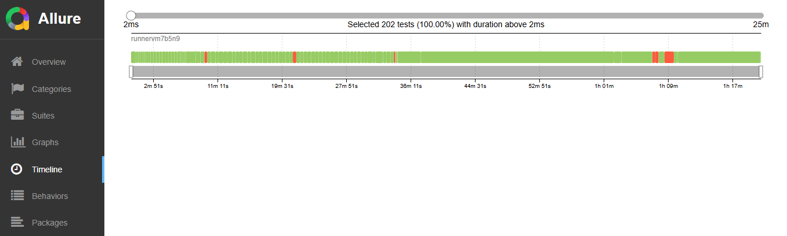
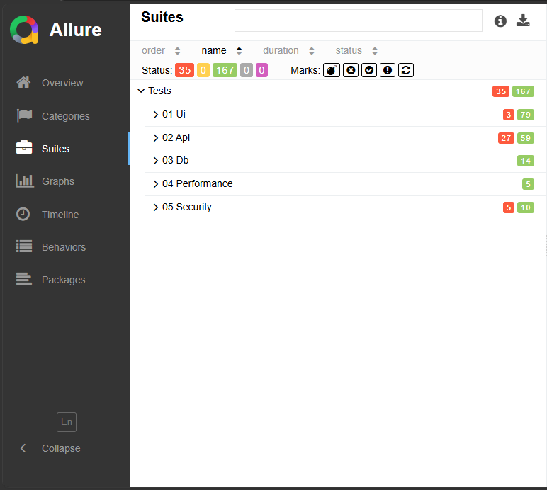

# 🚀 Robot Framework E2E Test Suite

A comprehensive QA Automation Framework built with **Robot Framework** to validate the OWASP Juice Shop application through multiple testing layers including UI, API, Database, Performance, and Security testing.

---

# 📌 Project Overview

This project demonstrates modern Quality Assurance practices by combining:

* UI Automation Testing
* API Testing
* Database Validation
* Performance Testing
* Security Testing
* CI/CD Automation
* Automated Reporting

The framework is designed to showcase real-world QA engineering workflows using industry-standard tools.

---

# 📊 Test Execution Summary

| Metric                 |           Result |
| ---------------------- | ---------------: |
| Total Tests            |              202 |
| Passed                 |              167 |
| Failed                 |               35 |
| Pass Rate              |           82.67% |
| Execution Time         |           1h 21m |
| Framework              |  Robot Framework |
| Application Under Test | OWASP Juice Shop |

---

# 🛠 Technology Stack

| Category            | Tool            |
| ------------------- | --------------- |
| Test Framework      | Robot Framework |
| UI Testing          | SeleniumLibrary |
| API Testing         | RequestsLibrary |
| Database Testing    | DatabaseLibrary |
| Performance Testing | k6              |
| Security Testing    | OWASP ZAP       |
| Reporting           | Allure Report   |
| Database            | SQLite          |
| Containers          | Docker          |
| CI/CD               | GitHub Actions  |
| Metrics Storage     | InfluxDB        |
| Monitoring          | Grafana         |

---

# 🖥 UI Automation Phase

## Summary

| Metric      | Result |
| ----------- | -----: |
| Total Tests |     82 |
| Passed      |     79 |
| Failed      |      3 |

### Covered Areas

* User Registration
* Login & Logout
* Product Catalog
* Product Search
* Basket Management
* Checkout Process
* Address Management
* Payment Management
* Order Confirmation
* Feedback Submission
* Navigation Validation

### Highlights

* Reusable Keywords
* Explicit Wait Strategies
* End-to-End Workflows
* Positive & Negative Testing
* Dynamic UI Validation

---

# 🔌 API Automation Phase

## Summary

| Metric      | Result |
| ----------- | -----: |
| Total Tests |     86 |
| Passed      |     59 |
| Failed      |     27 |

### Covered Areas

* Authentication APIs
* Registration APIs
* Basket APIs
* Checkout APIs
* Product APIs
* Feedback APIs
* Negative API Testing
* Contract Validation

### Highlights

* Status Code Validation
* Response Schema Validation
* Negative Testing
* Data Integrity Verification
* Security-Oriented API Checks

---

# 🗄 Database Automation Phase

## Summary

| Metric      | Result |
| ----------- | -----: |
| Total Tests |     14 |
| Passed      |     14 |
| Failed      |      0 |
| Pass Rate   |   100% |

### Covered Areas

* User Data Validation
* Product Data Validation
* Basket Data Validation
* Feedback Validation
* Query Performance Verification
* Database Security Validation

### Highlights

* Direct SQL Assertions
* Data Integrity Checks
* Parameterized Queries
* Database Performance Verification

---

# ⚡ Performance Testing Phase

Performance testing is implemented using **k6** and integrated directly into Robot Framework.

Performance metrics are exported to **InfluxDB** and visualized using **Grafana** dashboards.

## Test Scenarios

### Smoke Testing

* Application availability validation
* Core endpoint verification
* Baseline performance metrics

### Load Testing

* Normal traffic simulation
* Concurrent user validation
* Throughput analysis

### Stress Testing

* High load simulation
* Breaking point identification

### Spike Testing

* Sudden traffic surge simulation
* Recovery validation

### Soak Testing

* Long-duration stability testing
* Resource consumption analysis

---

# 📈 Grafana Dashboards

## Smoke Test Dashboard

> Add screenshot here



---

## Load Test Dashboard

> Add screenshot here



---

## Stress Test Dashboard

> Add screenshot here



---

## Spike Test Dashboard

> Add screenshot here



---

## Soak Test Dashboard

> Add screenshot here



---

# 🔒 Security Testing Phase

Security testing is implemented using:

* OWASP ZAP
* Robot Framework
* RequestsLibrary

The objective is to validate and document known vulnerabilities within OWASP Juice Shop.

## Summary

| Metric      | Result |
| ----------- | -----: |
| Total Tests |     15 |
| Passed      |     10 |
| Failed      |      5 |

### Security Areas Covered

#### SQL Injection

* Authentication bypass testing
* Input manipulation validation

#### Cross-Site Scripting (XSS)

* Reflected XSS
* Stored XSS
* Payload execution testing

#### Broken Access Control

* Unauthorized endpoint access
* Resource enumeration

#### Path Traversal

* Directory traversal attempts
* Sensitive file access validation

#### Malicious File Upload

* Executable upload attempts
* Server-side validation testing

#### Security Scanning

* OWASP ZAP Spidering
* Passive Analysis
* Active Vulnerability Scanning

### Note

OWASP Juice Shop is intentionally vulnerable. Security tests are designed to discover and document vulnerabilities while demonstrating security testing methodologies.

---

# 📋 Allure Reporting

The framework automatically generates professional Allure Reports after each execution.

## Features

* Test Overview Dashboard
* Test Categories
* Test Suites Breakdown
* Timeline Visualization
* Severity Distribution
* Duration Analysis
* Failure Investigation
* Historical Trends

---

## Allure Overview

> Insert screenshot: overview.png



### Remarks

* 202 total test cases executed
* 167 passed
* 35 failed
* 82.67% pass rate
* 1h 21m execution duration

---

## Allure Graphs

> Insert screenshot: graphs.png



### Remarks

* Pass/Fail distribution
* Severity breakdown
* Duration analysis
* Execution statistics

---

## Allure Timeline

> Insert screenshot: timeline.png



### Remarks

* Visual execution flow
* Long-running test identification
* Bottleneck analysis

---

## Allure Suites

> Insert screenshot: suites.png



### Remarks

| Suite       | Passed | Failed |
| ----------- | -----: | -----: |
| UI          |     79 |      3 |
| API         |     59 |     27 |
| Database    |     14 |      0 |
| Performance |      5 |      0 |
| Security    |     10 |      5 |

---

# 🚀 GitHub CI/CD Pipeline

The project includes a fully automated GitHub Actions pipeline.

## Trigger Events

* Push to Main Branch
* Pull Requests
* Manual Workflow Dispatch

## Pipeline Workflow

```text
Developer Push
        ↓
GitHub Actions
        ↓
Start Docker Services
        ↓
Execute UI Tests
        ↓
Execute API Tests
        ↓
Execute Database Tests
        ↓
Execute Performance Tests
        ↓
Execute Security Tests
        ↓
Generate Allure Report
        ↓
Publish Artifacts
```

## CI/CD Features

### Automated Infrastructure

* OWASP Juice Shop Container
* InfluxDB Container

### Automated Testing

* UI Validation
* API Validation
* Database Validation
* Performance Testing
* Security Testing

### Automated Reporting

* Allure Results Generation
* Allure Report Publishing
* Artifact Storage

### Benefits

* Faster Feedback
* Consistent Execution Environment
* Automated Quality Gates
* Repeatable Test Runs

---

# 📂 Project Structure

```text
robot-framework-e2e-test-suite
│
├── tests/
│   ├── 01_ui/
│   ├── 02_api/
│   ├── 03_database/
│   ├── 04_performance/
│   └── 05_security/
│
├── resources/
├── core/
├── figures/
├── juice-shop-db/
├── allure-results/
├── allure-report/
├── .github/
│   └── workflows/
│
└── README.md
```

---

# 🎯 Current Status

| Component           | Status     |
| ------------------- | ---------- |
| UI Testing          | ✅ Complete |
| API Testing         | ✅ Complete |
| Database Testing    | ✅ Complete |
| Performance Testing | ✅ Complete |
| Security Testing    | ✅ Complete |
| Allure Reporting    | ✅ Complete |
| GitHub CI/CD        | ✅ Complete |

---

# 🔮 Future Improvements

* Jenkins Integration
* Docker Compose Environment
* Parallel Test Execution
* Kubernetes Test Environment
* Historical Trend Analysis
* Performance Regression Detection
* Advanced Security Scanning

---

# 👨‍💻 Author

## Mohamed Saad BAZOURHI

**Junior QA Engineer | Test Automation Engineer | Cybersecurity Graduate**

⭐ If you found this project useful, consider giving it a star.
